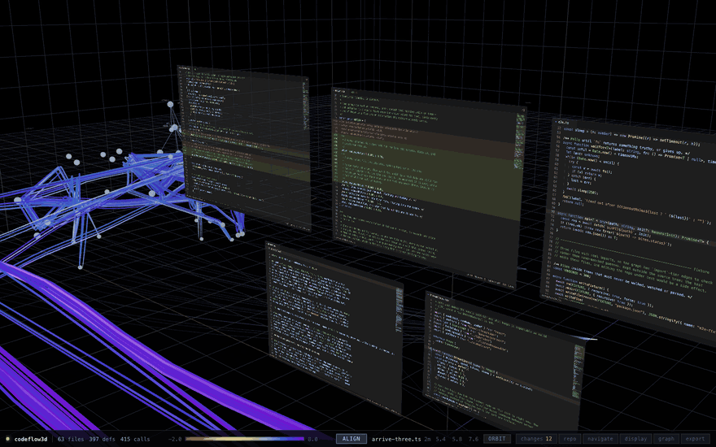

# codeflow3d

**Watch an AI edit your codebase, live, in 3D.**

An agent can touch twenty files in a minute, and all you get back is a wall of
tool calls and a diff at the end. Point this at the repository it is working in:
every file becomes a code window, every call becomes a path between them, and
every write arrives as motion through the graph *while it happens*. You see where
in the architecture the work is landing, what it reaches into next, and what it
has not touched at all.



*One take, unedited. Every arrival is a real file, written while the recording ran.*

## Run it

```bash
bun install
bun run dev                       # traces this repo's own source
bun run dev /path/to/your/repo    # or point it anywhere
```

Viewer on <http://localhost:5188>. Or through the Makefile: `make run`,
`make up` (background), `make status`, `make kill`, `make test`.

Then edit a file in that repo and save. The screen scrolls to the edit, the
changed lines type themselves in, and the definitions you touched warm up.

## Languages

Parsed into the call graph with tree-sitter:

**TypeScript · TSX · JavaScript · JSX · Python · Rust · Go**

Imports resolve to real files — Node relative/index resolution, Python dotted
packages, Rust `mod`/`crate` paths, Go package directories — and JSX element
usage counts as an edge, so a React component tree is part of the graph.

Every other text file (`package.json`, README, Dockerfile, YAML, TOML, SQL, CSS)
is tracked, diffed and given a screen too. Those contribute no nodes: the graph
stays a call graph.

## What you are looking at

| | |
| --- | --- |
| **Screens** | The files that changed most recently, newest first — each drawn as a real code window: VS Code's palette and line box, gutter, indent guides, minimap, status bar. Double-click to fly in until one fills the frame. |
| **Streamlines** | Real call paths, bundled through the directories they pass through. Cool is settled code, warm is code written seconds ago. |
| **Axes** | X is call depth (entry points left, leaves right), Z is module lane, Y is position within the file. |
| **Glyphs** | Definitions the traced paths visit, sized by fan-in + fan-out. One seen for the first time flares, then settles. |
| **Flow rails** | On each screen, the lines the traced call graph actually runs through. |
| **Arrivals** | A new file slides into the row from outside it and fades up while every other screen travels to its new slot, a beat apart. One that runs out of slots fades out rather than vanishing. |

**Keys** — WASD/arrows move, Q/E down and up, shift sprints, F switches orbit and
fly, Tab opens the controls, C the change log, G re-aligns the screens, Escape
backs out.

## Editing

Click a row in the change log to open that file full screen — the same editor as
the screens, at desk distance. `edit` to type, `⌘S` to save; the write goes to
disk, the watcher sees it, and the graph updates exactly as it would for an edit
made anywhere else.

## Speed

A full scan of this repository is ~300ms; a 2,700-file tree parses in ~2s. An
incremental re-parse plus a complete graph rebuild is ~1ms, and end to end a save
reaches the screen in **~8ms**. Only the sections of the scene that changed are
sent, so a save re-renders one screen rather than reloading the view.

```
local path → chokidar → tree-sitter (one file) → resolve imports and call sites
           → diff → layout → WebSocket → React + three.js
```

## More

- **[How it works](docs/architecture.md)** — edge confidence tiers, every element
  in the scene, unsaved-buffer capture, the 8ms path, the editor push extension,
  GLB export, the HTTP/WebSocket API, production build.
- `make test` boots the whole stack against a throwaway repository and asserts
  the chain end to end, 73 checks. Start there.

Built on [tree-sitter](https://tree-sitter.github.io/tree-sitter/),
[Bun](https://bun.sh), [three.js](https://threejs.org),
[React Three Fiber](https://r3f.docs.pmnd.rs), [React](https://react.dev),
[zustand](https://zustand.docs.pmnd.rs),
[chokidar](https://github.com/paulmillr/chokidar) and [Vite](https://vite.dev).

## Collaboration

Open to any collaboration — ideas, features, integrations, or something built on
top of this. Get in touch: [shusterilyaman@gmail.com](mailto:shusterilyaman@gmail.com),
or open an issue on [GitHub](https://github.com/ilyashusterman/codeflow3d).

## License

[MIT](LICENSE) — do what you like with it, keep the notice.
